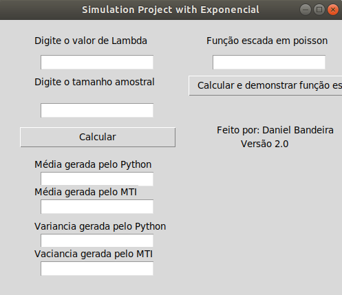
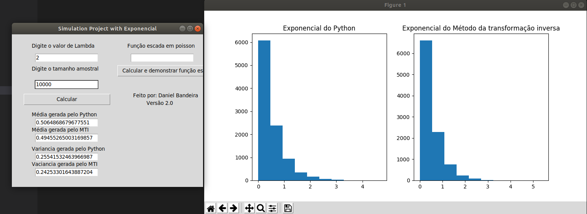
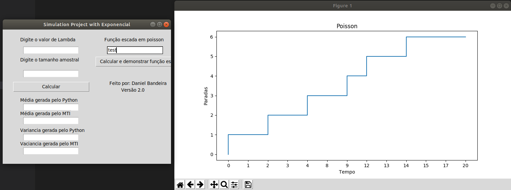

# ExpoPoisson
Software for implements graphics about expovariates and Poisson values

# Description

This is a software that test the inverse transform samplig that recieve the lambda and sample space, he generate random uniforms at size of sample space, after this we use the expovariate to transform in random variables, we do , where X is each uniform.
He recive a .csv to test the ladder function, to transform in poisson and export the graphic in Matplotlib


# Install

Packages:

```
cycler==0.10.0
docutils==0.14
kiwisolver==1.0.1
matplotlib==3.0.1
numpy==1.15.4
pkg-resources==0.0.0
pyparsing==2.3.0
python-dateutil==2.7.5
six==1.11.0
statistics==1.0.3.5

```

First of all you have to install virtualenv in your machine, and install python3-tk, because of tkinter:

```sudo apt-get install virtualenv```
```sudo apt-get install python3-tk```

After you have to active the virtualenv using:

```source venv/bin/activate```

Now install the packages using pip:

```pip install -r requirements.txt```

# Run the program

All of the codes are developed in python version 3.6.6, só to run we have to use:

```python3 mainGui.py```

# Program GUI







# To do

- [ ] Transform all GUI in web
- [ ] Put to transform in Poisson variables

